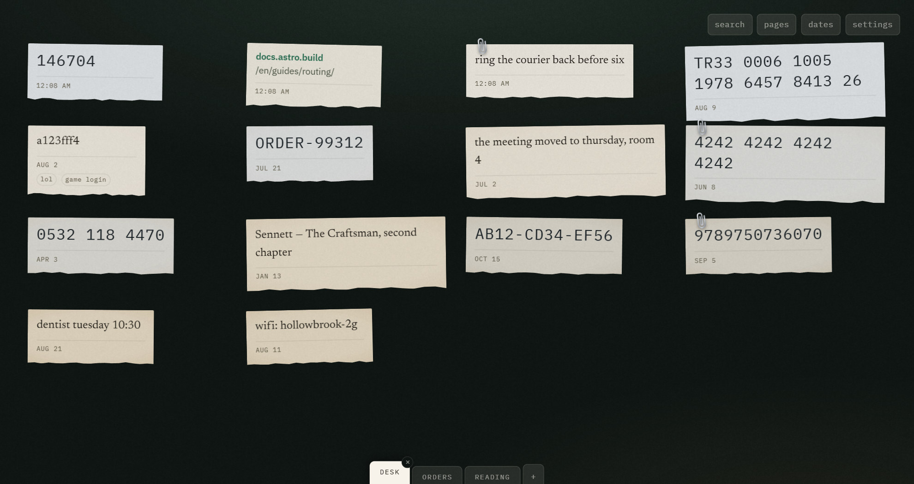
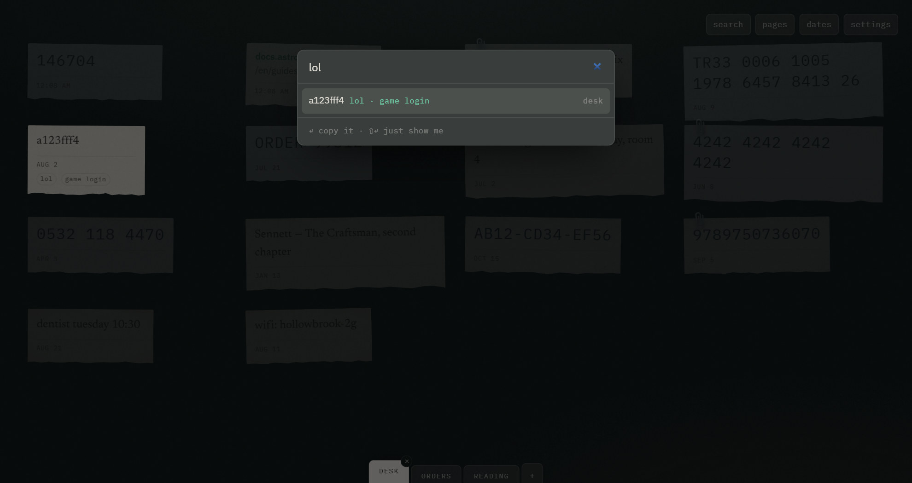
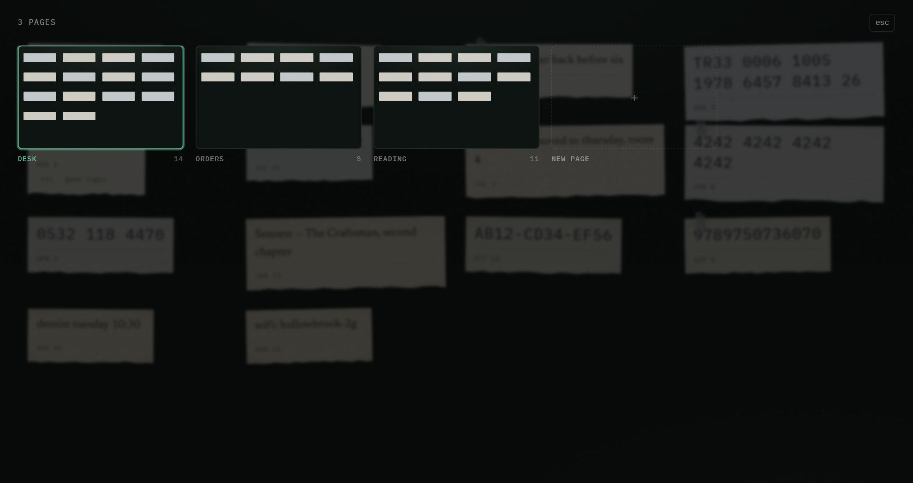
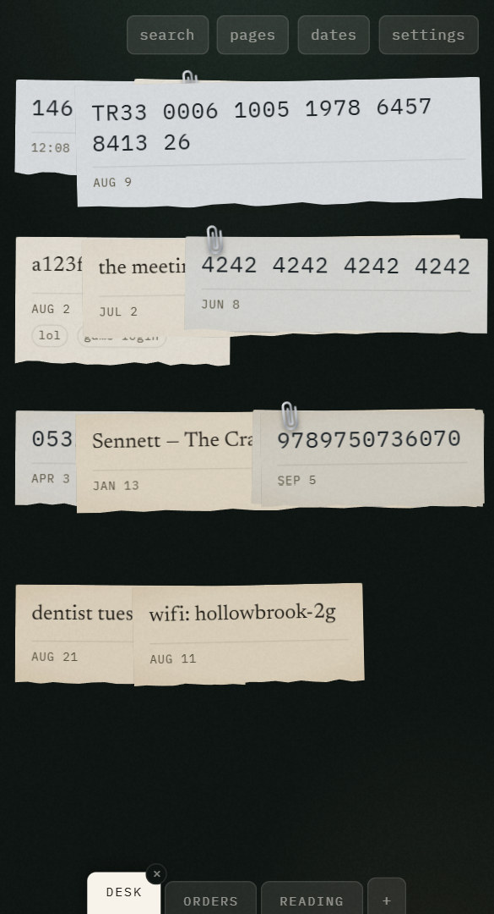

<div align="center">

<picture>
  <source media="(prefers-color-scheme: dark)" srcset=".github/media/lockup-white.svg" />
  
</picture>

### Paste it and go. It is still there when you come back.

A local-only desk for the small things — codes, links, half-thoughts.<br />
No account, no server, no sync, no telemetry.

**[Open the desk →](https://pastespot.vercel.app)**

<br />



</div>

<br />

You have a six-digit code on screen and nowhere to put it. Every note app wants you
to pick a notebook, name the note and press save first. This one wants two actions:
**click an empty patch of desk, paste.** Then close the tab. There is no landing
page in front of it — opening the site opens the desk.

Everything else in here exists to protect those two actions.

## It types itself

You never choose a format. What you paste decides how it looks, on every render,
from the text alone:

| You paste | It becomes |
| --- | --- |
| `146704` | large monospace, because the reason it exists is to be read back |
| `4242424242424242` | regrouped in fours, so you can read it aloud or check it |
| `https://docs.astro.build/…` | a link, host emphasised, scheme dropped |
| `ring the courier back` | serif prose with room to breathe |

The **text itself is never altered** — only how it is shown. A copy hands back
exactly what you pasted.

Paper ages, too. Something from this morning is bright white; something from last
spring is tea-stained. That is the only way the desk shows time at a glance, and it
costs no space, no control and no chrome.

## Finding it again

Three different questions, so three answers rather than one search box pretending to
cover all of them.

<table>
<tr>
<td width="50%" valign="top">

**"What does it say?"** — <kbd>⌘K</kbd>

Matching slips stay exactly where they are and the rest dim, so spatial memory
survives the search. Choosing a result **copies it** and then goes to the slip, lit —
because that is usually why you were looking. With nothing typed it offers your most
recent captures, so <kbd>⌘K</kbd> <kbd>↵</kbd> hands back the last thing you put down.

</td>
<td width="50%" valign="top">



</td>
</tr>
<tr>
<td width="50%" valign="top">

**"Which desk did I put it on?"** — <kbd>⌘P</kbd>

Every page drawn as a small desk, slips in their real positions. A list of names
would throw away the one thing the desk is for, and `page 47` was never worth
remembering anyway.

</td>
<td width="50%" valign="top">



</td>
</tr>
</table>

**"What did I write down on Tuesday?"** — the **dates** view opens a month at a time,
busy days inked more heavily, with the chosen day's slips listed underneath.

Some slips cannot be found by their own text at all: a password reads `a123fff4` and
nothing about those characters will ever come to mind. Any slip can be given
**keywords** from its own foot — write `lol` on it and searching `lol` finds it. Never
during capture, only afterwards. It is not a tag system: no list, no autocomplete,
nothing to browse by.

## Nothing is lost by accident

<kbd>⌘Z</kbd> takes back a deletion, a move, a label, a renamed or deleted page, or an
import. The slip that comes back lights up — that is the whole acknowledgement, and
the only notification this app has. Typing is left to the browser's own undo.

Two tabs of the same desk stay in step: whichever one saves tells the other, and a tab
returning to the foreground re-reads what it missed while it slept.

And when a browser will not store anything at all — a private window, blocked site
data — the desk says so in a band across the top rather than looking healthy right up
until the reload.

## On a phone

<table>
<tr>
<td width="62%" valign="top">

A grid built for a 1440px window buries slips on a 390px one, so a narrow desk gets
**fewer columns, not narrower ones**: one column below 560px, two below 900px. A short
desk drops rows the same way, and how many slips a page holds follows from the same
numbers — so a phone simply opens its next page sooner.

Nothing is fixed at a size that only made sense on a laptop.

</td>
<td width="38%" valign="top">



</td>
</tr>
</table>

## Keyboard

<kbd>⌘</kbd> below is <kbd>Ctrl</kbd> on Windows and Linux; the app works out which
one you have and says so in its own tooltips.

<kbd>⌘V</kbd> is the whole capture gesture with the click removed, so nothing here
needs a pointer. <kbd>Tab</kbd> reaches the controls first and then every slip and its
actions, and a screen reader is told when something is saved, deleted, undone,
labelled, or when you move between pages.

| | |
| --- | --- |
| Click an empty spot | a new slip, there |
| <kbd>⌘V</kbd> | a new slip, placed for you |
| <kbd>⌘K</kbd> | search, and copy what you find |
| <kbd>⌘P</kbd> | every page at once |
| <kbd>⌘Z</kbd> | take back the last change |
| <kbd>⌘[</kbd> / <kbd>⌘]</kbd> | previous / next page |
| Drag a slip's timestamp | move it, and bring it to the front |
| Drag a slip's **copy** | drop the text into another window |
| Double-click the active tab | rename the page |

## The extension

`extension/` is a Manifest V3 extension with no build step: open `chrome://extensions`,
turn on developer mode, **Load unpacked**, choose the folder.

Open it with <kbd>⌘⇧Y</kbd>, paste, press Enter — or select text on any page and
right-click **Send selection to pastespot**.

There is no server to send to, so a capture waits in the extension's own storage until
a pastespot tab exists, and the badge shows how many are waiting. The extension never
writes the database itself: it hands the text to the page, which stores it through the
same path as every other capture. So the schema lives in one place, and a failed
handover keeps the queue instead of losing it.

## Run it

Requires [bun](https://bun.sh) 1.2 or newer.

```bash
bun install
bun run dev      # http://localhost:4321
bun run build    # static output in dist/
bun run check    # type check
bun test         # bun's own runner, no framework
```

## How it is built

| | |
| --- | --- |
| **Astro 7** | zero-config static build; there is one route and it is the app |
| **React 19** | a single island, hydrated `client:only` because the desk reads IndexedDB before it can render |
| **zustand** | one small store, no slices |
| **IndexedDB** | the entire backend, through `idb-keyval` |
| **Plain CSS** | tokens in `src/styles/tokens.css`; the paper look is too bespoke for a utility framework |

No server, no API route, no build-time data, no analytics.

## Privacy

Everything lives in your browser's IndexedDB and is transmitted nowhere. After the
first visit the desk opens with the network off.

Clearing site data deletes it, so settings has **export json** and **export text**. The
JSON round-trips back through **import**; the text file is the one that will still open
in ten years. Importing only ever adds — a restored backup can duplicate slips, but it
can never overwrite what is already on the desk.

## License

[**AGPL-3.0**](./LICENSE) — Copyright © 2026 canbedir.

Read it, learn from it, fork it, run your own. If you deploy a modified version where
other people can use it, that version's source has to be available to them too.

That is the same promise the app itself makes about your data, pointed at the code:
nothing here is kept from the person using it. A permissive licence would let someone
take the desk, close it, and ship it as a product — the one outcome worth preventing.
Plain GPL would not have managed it, because a web app is served rather than
distributed, and GPL-2 is ruled out outright: `idb-keyval` ships inside the bundle
under Apache-2.0, which GPL-2 cannot include.

<details>
<summary>What else is in here, and under what terms</summary>

| | |
| --- | --- |
| Astro, React, zustand | MIT |
| `idb-keyval` | Apache-2.0 |
| Newsreader, IBM Plex (subset, in `public/fonts/`) | SIL OFL 1.1 — see [`public/fonts/LICENSE.txt`](./public/fonts/LICENSE.txt) |
| The pastespot mark and wordmark | © 2026 canbedir, all rights reserved — the code is AGPL, the brand is not |

</details>
